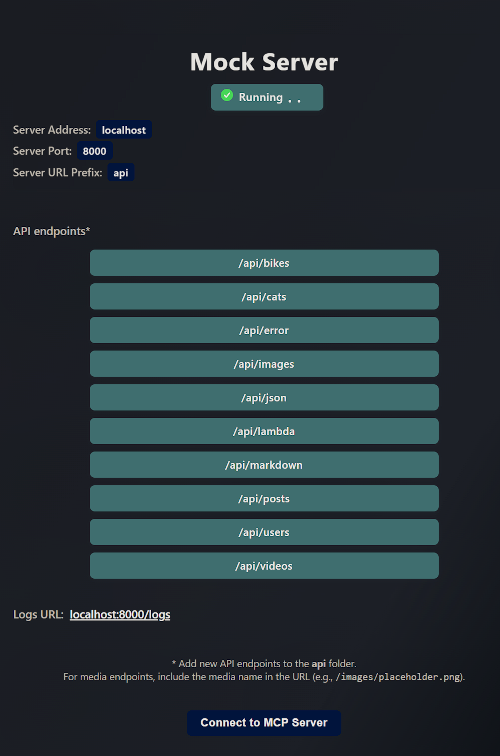

# Local Mock API Framework


[](https://opensource.org/licenses/MIT)

## Table of Contents

- [Overview](#overview)
- [Quick Start](#quick-start)
    - [Prerequisites](#prerequisites)
    - [Installation & Setup](#installation--setup)
    - [Alternative: Local Development](#alternative-local-development)
    - [Useful Commands](#useful-commands)
- [Creating API Endpoints](#creating-api-endpoints)
    - [File-Based Routing](#1-file-based-routing)
    - [Handler Implementation](#2-handler-implementation)
    - [Database Integration](#3-database-integration-optional)
- [Data Management](#data-management)
    - [Seeding Options](#seeding-options)
    - [Git LFS for Large Files](#git-lfs-for-large-files)
- [Serving Static Resources](#serving-static-resources)
    - [Images and Videos](#images-and-videos)
    - [Markdown Files](#markdown-files)
    - [JSON Files](#json-files)
- [Advanced Features](#advanced-features)
    - [Custom Middleware](#custom-middleware)
    - [Error Testing](#error-testing)
    - [CORS Configuration](#cors-configuration)
    - [AWS Lambda Development](#aws-lambda-development)
- [Request Logging](#request-logging)
    - [Enable Logging](#enable-logging)
    - [Implement Logging](#implement-logging)
- [Configuration](#configuration)
    - [Environment Variables](#environment-variables)
    - [URL Structure Examples](#url-structure-examples)
- [MCP Server Integration (Experimental)](#mcp-server-integration-experimental)
    - [Setup](#setup)
    - [Available Tools](#available-tools)
    - [Debugging MCP](#debugging-mcp)
    - [Known Issues](#known-issues)
- [Development Workflow](#development-workflow)
    - [Best Practices](#best-practices)
    - [Folder Structure](#folder-structure)
- [Contributing](#contributing)
- [Resources](#resources)

## Overview

A quick-to-setup standalone local mock API framework for developing API endpoints on localhost. Perfect for testing API code, rapid prototyping, and developing frontend clients before deploying to live servers.

Built with MSW and TypeScript, this framework can run directly on your local machine or in Docker containers.

### Key Features

- **Static File Serving**: JSON, text, images (with dynamic resizing), videos, and markdown
- **Database Operations**: CRUD operations with persistent or temporary mock data
- **AWS Lambda Testing**: Develop and test Lambda functions locally
- **Custom Middleware**: Transform input/output with custom logic
- **Error Mocking**: Test frontend error handling with configurable error responses
- **Request Logging**: Store and view API requests at `localhost:8000/logs`
- **MCP Server**: Experimental LLM agent integration for server management

## Quick Start

### Prerequisites

- Node.js 20+
- Docker

### Installation & Setup

1. **Clone and install dependencies**

    ```bash
    npm install
    ```

2. **Start with Docker** (recommended)

    ```bash
    npm start
    ```

3. **View your APIs**
    - Dashboard: http://localhost:8000/
    - API list: http://localhost:8000/api



### Alternative: Local Development

For active development:

```bash
npm run dev
```

### Useful Commands

| Command           | Description                    |
| ----------------- | ------------------------------ |
| `npm start`       | Start in Docker                |
| `npm stop`        | Stop and remove containers     |
| `npm run rebuild` | Rebuild containers             |
| `npm run nuke`    | Destroy everything and rebuild |
| `npm run dev`     | Run locally (for development)  |

## Creating API Endpoints

### 1. File-Based Routing

The system uses NextJS-style file-based routing. Create a folder in `/api` that maps to your desired route.

**Example: Creating `/api/users`**

```bash
mkdir src/api/users
```

### 2. Handler Implementation

Create `api.ts` in your new folder:

```typescript
// src/api/users/api.ts
import { http, HttpResponse } from 'msw';

function handler(pathName: string) {
	return [
		http.get(`/${pathName}`, ({ request }) => {
			// Your GET logic here
			return HttpResponse.json({ users: [] });
		}),
		http.post(`/${pathName}`, ({ request }) => {
			// Your POST logic here
			return HttpResponse.json({ success: true });
		}),
	];
}

export default handler;
```

### 3. Database Integration (Optional)

#### Create Models

Models go in `/models` directory:

```typescript
// models/users.ts
import { primaryKey } from '@mswjs/data';

export const userModel = {
	id: primaryKey(String),
	name: String,
	email: String,
};
```

#### Register Models

Add to `db.ts`:

```typescript
import { userModel } from './models/users';

export const db = factory({
	user: userModel,
	// ... other models
});
```

#### Auto-Generated REST API

Using `db.user.toHandlers('rest')` automatically creates:

- `GET /users` - List all users
- `GET /users/:id` - Get user by ID
- `POST /users` - Create user
- `PUT /users/:id` - Update user
- `DELETE /users/:id` - Delete user

## Data Management

### Seeding Options

Choose one of three approaches:

#### Option 1: Manual Data Entry

Add data via POST/PUT requests (temporary, lost on restart)

#### Option 2: Fake Data Generation

Use seeders with faker.js for random data:

```typescript
// seeders/user-seeder.ts
import { faker } from '@faker-js/faker';
import { db } from '../db';

export function seedUsers() {
	for (let i = 0; i < 10; i++) {
		db.user.create({
			id: faker.string.uuid(),
			name: faker.person.fullName(),
			email: faker.internet.email(),
		});
	}
}
```

#### Option 3: Persistent Data

Create `data.json` in `/data` folder for consistent data across restarts.

### Git LFS for Large Files

For large database files, images, or videos:

```bash
# Track database files
git lfs track --filename src/data/data.json

# Track image files
git lfs track "*.png"
```

## Serving Static Resources

### Images and Videos

Store files in `src/resources/{images|videos}` and access via:

```
http://localhost:8000/api/images/placeholder.png
http://localhost:8000/api/videos/sample.mp4
```

#### Dynamic Image Resizing

Resize PNG images by adding width and height parameters:

```
http://localhost:8000/api/images/placeholder.png?width=300&height=500
```

### Markdown Files

Store in `src/resources/markdown` with code highlighting support:

```
http://localhost:8000/api/markdown/demo
```

### JSON Files

Store in `src/resources/json`:

```
http://localhost:8000/api/json/demo
```

## Advanced Features

### Custom Middleware

Extract URL parameters and add custom logic:

```typescript
// URL parameters: /api/bikes/?type=KawasakiNinja
const type = url.searchParams.get('type');

// Dynamic paths: /api/images/:imageId
const imageId = url.pathname.split('/').pop();
```

### Error Testing

Mock API errors for frontend testing:

```
# Default 404 error
http://localhost:8000/api/error

# Custom error
http://localhost:8000/api/error?status=500&message=Internal%20Server%20Error
```

### CORS Configuration

Set CORS headers in your handlers:

```typescript
headers: {
    'Content-Type': 'application/json',
    'Access-Control-Allow-Origin': '*', // or 'localhost:3000'
}
```

### AWS Lambda Development

Develop Lambda functions in `src/lambdas` directory. Use `requestToApiGatewayProxyEvent` utility to convert MSW requests to AWS API Gateway format.

## Request Logging

Monitor API requests and responses at `localhost:8000/logs`.


### Enable Logging

Set environment variables in `.env`:

```env
LOG_REQUESTS=ON
DELETE_LOGS_ON_SERVER_RESTART=ON
```

### Implement Logging

Add to your handlers:

```typescript
import logger from '../../utilities/logger';

logger({
	data: extractedData,
	pathName,
	type: 'GET',
});
```

## Configuration

### Environment Variables

Customize your setup in `.env`:

```env
# Change API prefix (default: "api")
USE_API_URL_PREFIX=api

# Change port (default: 8000)
SERVER_PORT=8000

# Logging
LOG_REQUESTS=ON
DELETE_LOGS_ON_SERVER_RESTART=ON
```

### URL Structure Examples

With different `USE_API_URL_PREFIX` settings:

- Default: `localhost:8000/api/users`
- Empty: `localhost:8000/users`
- Custom: `localhost:8000/things/users`

## MCP Server Integration (Experimental)

### Setup

1. **Build MCP server**

    ```bash
    npm run mcp:build
    ```

2. **Configure your LLM agent** with the server path:
    ```bash
    <path_to_project>/src/mcp/server.js
    ```

### Available Tools

- **Server Management**: Start, stop, rebuild, and check endpoints
- **Endpoint Creation**: Generate new API endpoints via LLM
- **Media Creation**: Ask the LLM to Generate images and videos to serve locally


### Debugging MCP

Test the MCP server with the inspector:

```bash
npm run mcp:debug
```

### Known Issues

#### Node Version Managers

With NVM/FNM on Windows, you may need to:

- Specify full path to node binary, or
- Add fnm aliases directory to system PATH

#### Custom Ports

If changing from port 8000, update `mcp/server.ts` PORT variable and rebuild:

```bash
npm run mcp:build
```

## Development Workflow

### Best Practices

1. **Development**: Use `npm run dev` for active development
2. **Testing**: Use `npm start` for Docker-based testing
3. **File Organization**: Follow the established folder structure
4. **Error Handling**: Test error scenarios using the error endpoint
5. **Logging**: Enable logging during development for debugging

### Folder Structure

```
src/
├── api/                 # API endpoints (file-based routing)
├── models/              # Database models
├── seeders/             # Database seeders
├── lambdas/             # AWS Lambda functions
├── resources/           # Static files
│   ├── images/
│   ├── videos/
│   ├── markdown/
│   └── json/
├── logs/                # Request logs
├── mcp/                 # MCP server files
└── utilities/           # Helper functions
```

## Contributing

This project uses MIT license. For issues with the experimental MCP server, please report them at: https://github.com/piyook/mock-api-framework-template/issues

## Resources

- [MSW Documentation](https://github.com/mswjs/msw)
- [MSW Data Utilities](https://github.com/mswjs/data)
- [Model Context Protocol](https://modelcontextprotocol.io/)
