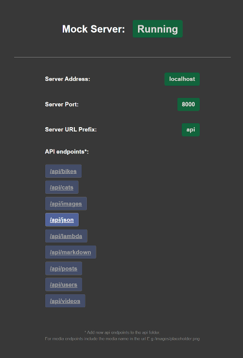
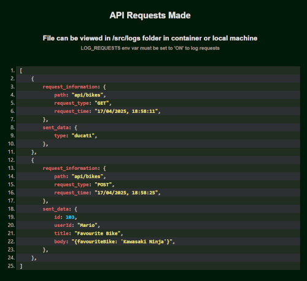

[](https://opensource.org/licenses/MIT)

# Local Mock API Framework

## Purpose

The purpose of this project is to provide a quick-to-set-up standalone local mock API framework to develop API endpoints running on localhost.

This can be used for serving a variety of different content, such as JSON data, images, videos and markdown for testing API code and logic before deploying to live servers or quickly producing API endpoints for rapid prototyping for developing frontend clients for web or mobile.

The project is built using MSW and can be run directly on a local machine or in Docker containers.

The framework is written in TypeScript and can :

- Serve data from static files (JSON or text)
- Serve media : Images and Videos
- Serve markdown files
- Be used to write and test AWS Lambda Functions
- Use custom middleware to transform input/output
- Serve random Database seed data
- Serve persisted mock data to the database
- Perform CRUD operations on the local database via a REST endpoint
- Mock API error codes/messages for testing frontend error handling logic
- Log and store API requests in JSON format and display information on the localhost:8000/logs route

## Set-up

Clone the repo or use the template button directly in GitHub to set-up a new repo using this one as a template.

#### Requirements

Node 20+ and Docker.

#### Git LFS

You can use git LFS to handle large files such as database files, videos or image files.

Use LFS to track large database files by running the command below

```bash
git lfs track --filename src/data/data.json
```

To track other types of files such as images or videos run the command below with the desired file type

```bash
git lfs track "*.png"
```

## Starting

#### Docker

To start in Docker run

```bash
npm start
```

The list of available APIs can be viewed on localhost:8000/api by default but this can be customised - see later.

A list of all endpoints can be viewed on http://localhost:8000/.

The project has been set-up with demo endpoints that can be removed or modified as needed.



### Useful Commands

To stop and remove containers run

```bash
npm stop
```

To rebuild containers run :

```bash
npm run rebuild
```

To destroy everything and then rebuild the project (removing node modules, caches and all docker resources) run:

```bash
npm run nuke
```

#### Local Machine

To run directly on your local machine instead of Docker

```bash
npm run dev
```

## Using the Mock API Framework

### Setting up a new API route

The system uses file-based routing (similar to NextJS) - simply create a folder in '/api' that is then mapped to an api route with the folder name.

This repo contains some existing APIs as starter demos and templates to create new endpoints for any project.

For example to create a new api route (E.g api/users)

#### 1. Create a **new folder** within the api folder the api path name you want:

```bash
mkdir src/api/users
```

#### IMPORTANT

Remember to use 'npm run dev' to start a local dev server when developing new API endpoints.

Once endpoints have been developed and tested then use 'npm run start' to build the docker image and start a container to serve the endpoints on localhost (or use 'npm run rebuild' or 'npm run nuke' if changes need to be made to an existing docker image).

#### 2. Create an **api.ts** file in this new folder and add handler logic here - see https://github.com/mswjs/msw for information on writing handlers.

Also take a look at the various example handlers in the api folder.

The mock api framework uses the msw-data utility - see https://github.com/mswjs/data and a full rest or graphql api can be automatically set-up from this without having to define each handler using the format below

```js
...db.user.toHandlers('rest')
```

#### 3. Create a database (if required)

Database models are held in **/models** directory.

a. Create new models in this directory as required - see the users.ts and posts.ts examples.

b. Import the new model into the db.ts file and add to the factory function - https://github.com/mswjs/data for more details

#### 4. Seeding the database

#### a. manually add data via POST/PUT Requests

Data can be manually added / amended via POST/PUT requests to the relevant REST endpoint. This data wont persist and will be lost when the server is restarted.

OR

#### b. seed database with fake data.

It is possible to seed the database with fake data using seeder functions and faker.js. See the seeders/user-seeder.ts and models/user.ts example.

Database seeders are located in the seeders folder.

**Note**: New seeders should be created here and added to the index.ts file in the same folder in order to be automatically imported and executed on server start.
This data will be different each time the server is started and the seeders re-run.

OR

#### c. populate the database with existing data

You can create a data.json file in the /data folder and import this to seed the database with data that will persist and be the same each time the server is started.

See the seeders/post-seeder.ts and models/post.ts example

#### 5. Serving Static Resources

Static resources such as json data, markdown, image or video files can be served by adding the file into the relevant directory in the resources folder.

The files can then be accessed from the relevant url - see later.

```js
http://localhost:8000/markdown/demo
```

### 5. Making Http Requests

Given the "user" model definition above, the following request handlers are auto-generated and connected to the respective database operations:

```js
    GET /users/:id // (Where "id" is your model's primary key), returns a user by ID;
    GET /users  // Returns all users (supports pagination);
    POST /users // Creates a new user;
    PUT /users/:id // Updates an existing user by ID;
    DELETE /users/:id // Deletes an existing user by ID;
```

The "/user" part of the route is derived from your model name. For example, if you had a "post" model defined in your factory, then the generated handlers would be /posts, /posts/:id, etc.

If handlers are manually created (E.g as in the Bikes folder) - then only the explicitly defined endpoints will be available.

### 6. Middleware

**Custom handlers** can contain 'middleware' code defined in an individual handler for each route and http header verb.

See the cat api for examples of custom handlers getting information from the database and bikes api for examples of simple 'middleware' added to a custom route.

Url parameters can be extracted using

```js
url.searchParams.get('type');
```

where type is a url parameter (/api/bikes/?type=KawasakiNinja). This can then be used in the middleware code as required.

Dynamic url pathnames (e.g localhost/api/images/:imageId) can be extracted using

```js
const params = url.pathname.split('/').pop();
```

where params will be the value of :imageId

#### CORS

For browser-based client application requests, set the desired CORS responses in the headers object in the relevant handler. For example, you can give any domain access to the resources using the wildcard '\*' or alternatively specify a permitted domain such as 'localhost:3000' for nextJS.

```js
 headers: {
                        'Content-Type': 'text/html',
                        'Access-Control-Allow-Origin': '*',
                    },
```

### 7. Available endpoints

Available endpoints are listed at the url root

```js
http://localhost:8000
```

### 8. AWS Lambda Functions

Lambda functions can be developed in the mock framework and then used in AWS CDK code.

Lambda functions are stored in the src/lambdas directory.

When a lambda is called from an api, the MSW/ExpressJS request object needs to be converted into an AWS API Gateway Proxy Event object using the requestToApiGatewayProxyEvent function in utilities. This mocks how a real API Gateway sends URL queries and body data to a Lambda so lambda code developed in should work in an API Rest Gateway setup.

Lambda functions created using NodeJSFunction() in the AWS CDK will be built and bundled using esbuild by the AWS CDK. Functions developed in this framework should work as expected but it will be necessary to check this using LocalStack or in a test AWS sandbox account.

### 9. Images and Videos

Images and Videos should be stored in the src/resources/{images or videos} folder.  
They can be accessed using the format http://localhost:8000/api/images/{image_filename.ext}.  
E.g

```js
    http://localhost:8000/api/images/placeholder.png
```

and

```js
    http://localhost:8000/api/videos/placeholder.mp4
```

### 10. Markdown

Markdown can be served from the markdown folder in src/resources/markdown and supports code highlighting. Note the url doesn't need to include .md

```
http://localhost:8000/api/markdown/demo
```

### 11. JSON files

JSON files are stored in the src/resources/json folder. See the api/json example which can be accessed from 'api/json/{filename}' (i.e without the .json extension).

```
http://localhost:8000/api/json/demo
```

### 12. Templates

The templates directory contains some templates for different type of handlers, models and seeders but the demo api endpoints can just as easily be copied and modified for individual use cases.

### 13. Error Route

It can be useful to mock api errors in order to test frontend error handling logic.

To do this redirect frontend fetch requests to the api/error route.

```
http://localhost:8000/api/error
```

The default error for this route is a '404: not found' error but if specific errors are required, then this can be customised by passing 'status' to the endpoint and also a custom 'message' if required.

E.g to mimic a 500 'Internal Server Error'

```
http://localhost:8000/api/error?status=500&message=Internal%20Server%20Error
```

this will return a 500 error code and the JSON response below:

```
{"error":"500: Internal Server Error"}

```

## Logging

API request information and sent data can be logged and stored as JSON in the /src/logs/ folder.

Logs can be viewed at **localhost:8000/logs**.



### Set-up

To enable logging set the environment variables below in the .env

```js
LOG_REQUESTS = ON;
DELETE_LOGS_ON_SERVER_RESTART = ON;
```

You can choose to refresh the logfile every time the server restarts or persist the data by setting the DELETE_LOGS_ON_SERVER_RESTART variable.

To set up logging for a route, add the following to the api.ts file in the relevant handler, adjusting the request type (GET/POST/PUT/DELETE) and passing data to be logged as required:

```js
import logger from '../../utilities/logger';

function handler(pathName: string) {
    return [
         http.get(`/${pathName}`, ({ request }) => {

            ...
                    logger({
                            data: { <- extracted request body or query params data here -> },
                            pathName,
                            type: 'GET',
                            });
            ...
         }),
    ]
}
```

**See the src/api/bikes api.ts file for an example of logging set up.**

## Customisation

### Changing api url prefix

By default the api paths will be prefixed with "api/" this can be modified with the
USE_API_URL_PREFIX environment variable in the .env file.

By setting this to blank then the path will just be the api name E.g localhost:8000/users

You can set this to any value E.g

```js
USE_API_URL_PREFIX = things;
```

will give localhost:8000/things/users

### Change port number

By default this is set to 8000 but can be changed by setting the SERVER_PORT in the .env file:

```js
SERVER_PORT = 1234;
```
